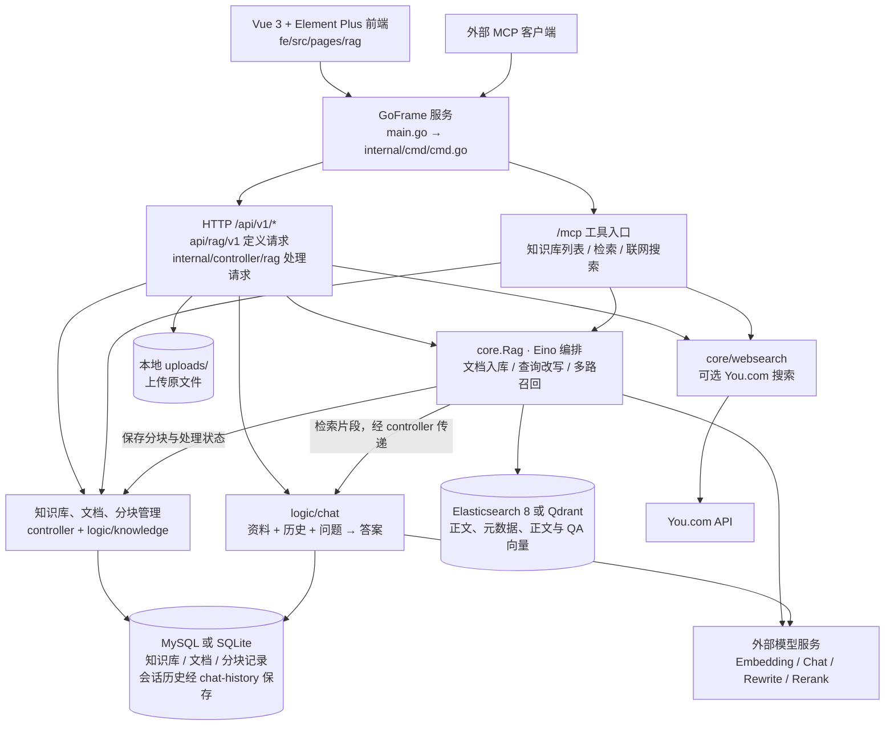
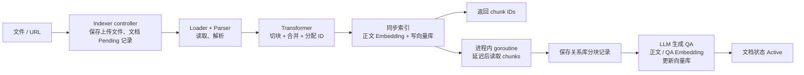
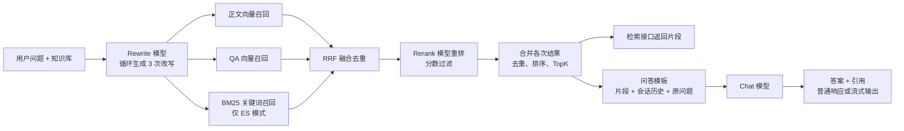

# go-rag 架构与学习入口

分析日期：2026-09-20。依据本地源码静态阅读，未启动服务或调用模型。

## 来源与版本

- 原始 GitHub：https://github.com/wangle201210/go-rag
- 本地目录：`C:\goproject\go-rag`
- 已核实 origin（fetch/push）：`https://github.com/wangle201210/go-rag.git`
- 当前分支：`main`
- 阅读基线：`0f488bb955e8023757273d3c772383169abba9d7`
- 用途：后续 Go / RAG 项目学习与改进样例。

## 总体架构



这是一个前后端分离开发、也可由 Go 服务托管前端静态产物的应用。不是多个独立 Go 微服务。GoFrame 管 HTTP，Eino 管 AI 组件和流程，Vue 管页面。

图表示主要职责和数据流，并非严格的分层依赖：controller 会直接调用 core；core/indexer.go 也依赖 internal/logic/knowledge 写入业务记录。不能把它理解为完全隔离的 Controller → Service → Repository 模板。

## 两条核心业务链

### 文档入库



源码要点：`core/indexer.go` 的注释说真正 embedding 异步执行，但 `core/indexer/indexer.go` 已为正文设置 EmbedKey 并接入 Embedding，因此同步阶段也会生成正文向量，异步阶段再补充 QA 等数据。上传返回不代表后台全部完成；后台是进程内 goroutine，没有持久化任务队列。

解析器显式支持 HTML、PDF、XLSX，其余走文本解析。Markdown 按标题切分；其他文档使用递归分割。具体配置见 `core/indexer/transformer.go`。

### 检索与问答



3 次改写在循环中依次生成，每次随后启动检索 goroutine；不要理解成所有步骤完全并行。每次检索中的多路召回在当前代码中依次执行。联网搜索是独立 HTTP/MCP 功能，没有自动接到普通聊天链路。grader 虽有源码，当前 Rag 初始化没有启用。

## 数据分别放在哪里

| 位置 | 职责 |
|---|---|
| uploads/ | 上传文件原件 |
| MySQL / SQLite | 知识库、文档、分块内容/元数据与状态；会话历史由 chat-history 包处理 |
| Elasticsearch / Qdrant | 可检索正文、元数据以及正文和 QA 向量；ES 额外支持 BM25 |

## 建议阅读顺序

所有源码路径均相对 `C:\goproject\go-rag`。

1. `server/main.go`、`server/internal/cmd/cmd.go`：程序如何启动、绑定路由与 MCP。
2. `server/api/rag/v1/chat.go`、`server/internal/controller/rag/rag_v1_chat.go`：先读短小的普通问答入口，抓住“先检索、再生成”。
3. `server/internal/logic/chat/message.go`：理解片段、历史、问题如何组成 prompt。
4. `server/core/retriever.go`：理解改写、多路召回、融合、重排；再深入 `core/retriever/rrf.go`。
5. `server/core/indexer.go`、`server/core/indexer/orchestration.go`、`server/core/indexer/async.go`：理解同步和异步入库。
6. `server/core/vector/interface.go`、`server/core/vector/factory.go`：联系已学的 interface 和不同实现；注意部分检索与索引仍直接区分 ES/Qdrant 客户端。
7. `server/internal/dao/db/interface.go`、`server/internal/dao/dao.go`：理解关系数据库选择与初始化。
8. `fe/src/pages/rag/chat.vue`：把前后端流式交互连起来。

先看普通 Chat，再看 ChatStream；流式链路增加 StreamReader、goroutine 和响应协议，更适合第二遍学习。项目多个包在 init() 中创建数据库与模型相关依赖，读启动流程时需同时看这些初始化。

## 后续更新原仓库

go-rag 是独立 Git 仓库，也是独立后端 Go module（`server/go.mod`）。运行 Go 命令应进入 `go-rag/server`，不要套用外层 `learn-go` 的模块路径。

先查看、再更新：

```powershell
git -C C:\goproject\go-rag status --short
git -C C:\goproject\go-rag fetch origin
git -C C:\goproject\go-rag log --oneline HEAD..origin/main
git -C C:\goproject\go-rag diff HEAD...origin/main --stat
```

工作区干净且本地 main 未与上游分叉时，可执行：

```powershell
git -C C:\goproject\go-rag switch main
git -C C:\goproject\go-rag pull --ff-only origin main
```

开始自行改进时建议使用单独分支，保留 origin 指向原作者。若以后 fork 并把 origin 改为自己的仓库，再把原作者地址保存为 upstream。本次只核实来源并记录，没有 fetch、pull、切换分支或修改 remote。
